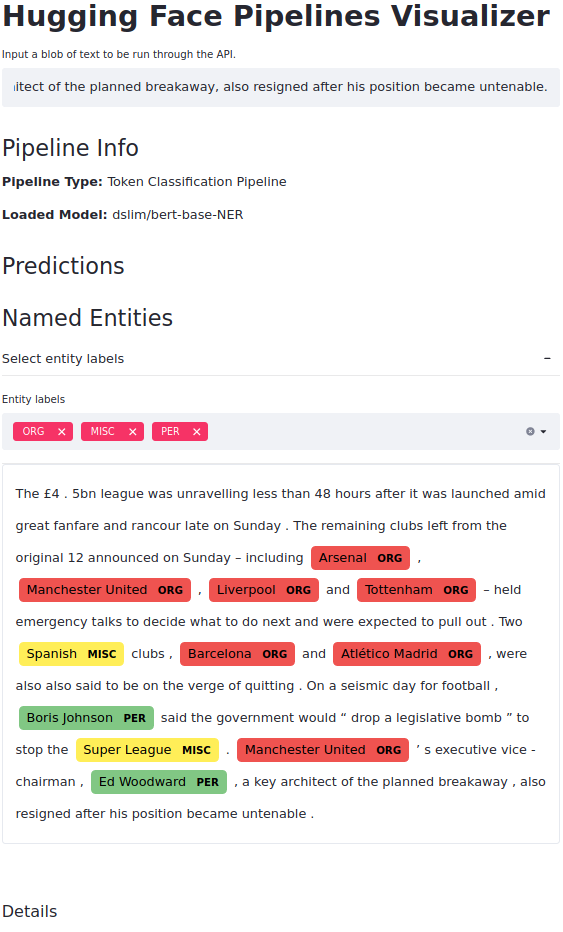
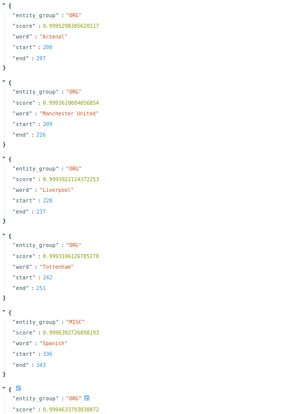

# Hugging Face Pipelines Server and Visualizer

### Description

The goal of this project is to offer a simple local server and visualization tool around <a href=https://huggingface.co/transformers/main_classes/pipelines.html>Hugging Face Pipelines</a>. It uses [FastAPI](https://fastapi.tiangolo.com/) and [Streamlit](https://streamlit.io/).

---

### Usage

- Create a virtualenv with python3.7+ and run `pip install -r requirements.txt`.
- Launch local server with: `./src/api/start.sh` .
- Run [streamlit](https://streamlit.io/) visualizer with: `streamlit run src/frontend/run_streamlit.py` .

---

### Supported Pipelines

| Task               | Pipeline | Hugging Face Hub Models |
|:------------------:|:--------:|:----------------------:|
| sentiment-analysis | TextClassificationPipeline | [Link](https://huggingface.co/models?pipeline_tag=text-classification) |
| ner | TokenClassificationPipeline | [Link](https://huggingface.co/models?pipeline_tag=token-classification) |

---

### API:

- Implemented with [FastAPI](https://fastapi.tiangolo.com/).
- Follows [tiangolo's uvicorn-gunicorn-docker](https://github.com/tiangolo/uvicorn-gunicorn-docker) structure.
- Supports all the environment variables described [here](https://github.com/tiangolo/uvicorn-gunicorn-docker#environment-variables).
    - To modify them locally do, e.g. `export MAX_WORKERS=2; ./src/api/start.sh` .

---

### Visualizer

- Implemented with [Streamlit](https://streamlit.io/), and with different visualizations according to the type of pipeline.
- Example for the `TokenClassificationPipeline`:

---

### Other Info

#### Automated Checks

- Run checks for lint, typing, tests, and coverage with `nox` .

#### Linting

- Run `run_lint.sh` or `black . -l 99` .

#### Typing

- Run `mypy --namespace-packages -p src` .

- Notes:
    - `--namespace-packages`: See [GitHub Issue](https://github.com/python/mypy/issues/1645#issuecomment-472623745) .
    - `-p`: See [GitHub Issue](https://github.com/python/mypy/issues/8944#issuecomment-678725333) .
    - Reused variables cause errors: See [GitHub Issue](https://github.com/python/mypy/issues/1174#issue-129268674) .

#### Tests/Coverage

- Run `coverage run --source=src/ -m pytest` .
- Run `coverage report -m` .